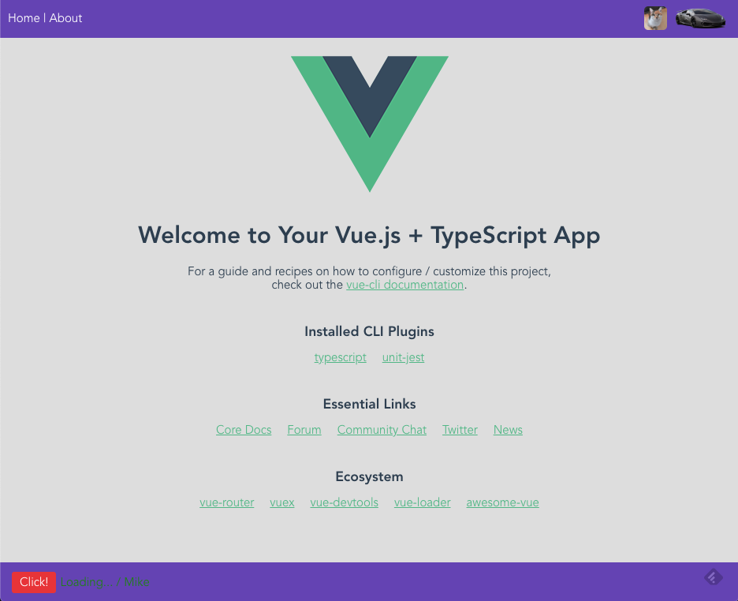

# VUE Typescript Starter
> [Live](http://vuetsstarter.example.mikemitterer.at) | [Home GitHub](https://github.com/MikeMitterer/vue-ts-starter)

Basically this App has three components: AppHeader, AppFooter, HelloWorld (for testing)
and two views: Home + About.

In `.env` is the title define - check it out.

'Click' modifies and displays text in the lower right

The cat on the top right is add statically, the Lamborghini is added dynamically. (AppHeader component)

For State Management I added a "CounterModule" (Vuex)  

      

## Environment-Vars and Template-Vars

These vars are set in `vue.config.js`
 
If you want to see how you can use e.g. `process.env.VUE_APP_VERSION` check out `AppFooter.vue`

`/public/index.html` tests if VUE_APP_DEV_MODE is set to true:
```html
...
<html lang="en" <%if(VUE_APP_DEV_MODE)%>>
...

``` 

## Project setup
```
yarn install
```

### Compiles and hot-reloads for development
```
yarn run serve
```

### Compiles and minifies for production
```
yarn run build
```

### Run your tests
```
yarn run test
```

### Lints and fixes files
```
yarn run lint
```

### Run your unit tests
```
yarn run test:unit
```

### Customize configuration
See [Configuration Reference](https://cli.vuejs.org/config/).
